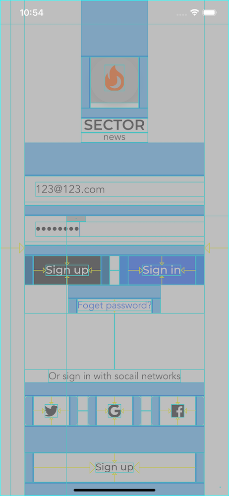

# flutter-fullstack-news

一个flutter全栈项目：flutter、eggjs、GraphQL、strapi、docker-compose

## Client

### Notes

- 极简 `main.dart`

```dart
import 'package:flutter/material.dart';

void main() {
  runApp(MyApp());
}

class MyApp extends StatelessWidget {
  @override
  Widget build(BuildContext context) {
    return MaterialApp(
      title: 'Material App',
      home: Scaffold(
        appBar: AppBar(
          title: Text("Material App Bar"),
        ),
        body: Center(
          child: Container(
            child: Text("Hello World"),
          ),
        ),
      ),
    );
  }
}
```

- 如何按设计稿尺寸初始化项目
  - 必要的插件 `flutter_screenutil`
  - 使用方法：**务必在 `main` 函数的第一个链接页面** 中加入初始化代码

```dart
class _WelcomePageState extends State<WelcomePage> {
  @override
  Widget build(BuildContext context) {
    ScreenUtil.init(context,
        width: 750, height: 812 - 44 - 34, allowFontScaling: true);

    return Scaffold(
      appBar: AppBar(
        title: Text("Material App Bar"),
      ),
      body: Center(
        child: Container(
          child: Text("Hello World"),
        ),
      ),
    );
  }
}

/// ------
import 'package:flutter_screenutil/flutter_screenutil.dart';

/*
  ScreenUtil.pixelRatio       // 设备的像素密度
  ScreenUtil.screenWidth      // 设备宽度
  ScreenUtil.screenHeight     // 设备高度
  ScreenUtil.bottomVarHeight  // 底部安全区距离，适用于全面屏下面有按钮的
  ScreenUtil.statusBarHeight  // 状态栏高度 刘海屏会更高 单位px
  ScreenUtil.textScaleFactor  // 系统字体缩放比例

  ScreenUtil.scaleWidth       // 实例宽度的dp 与设计稿px的比例
  ScreenUtil.scaleHeight      // 实例高度的dp 与设计稿px的比例
*/

/// 设置宽度

double kSetWidth(double width) {
  return ScreenUtil().setWidth(width);
}

double kSetHeight(double height) {
  return ScreenUtil().setHeight(height);
}

double kSetFontSize(double fontSize) {
  return ScreenUtil().setSp(fontSize);
}
```

- 封装后如何使用
  - 为什么要这样封装？好处可以设置和设计稿一样的字体大小，按屏幕比例缩放！

```dart
Widget _buildPageHeadTitle() {
  return Container(
    margin: EdgeInsets.only(top: kSetHeight(65)),
    child: Text(
      "Features",
      textAlign: TextAlign.center,
      style: TextStyle(
        color: AppColors.primaryText,
        fontFamily: "Montserrat",
        fontWeight: FontWeight.w600,
        fontSize: kSetFontSize(24),
      ),
    ),
  );
}
```

- `FlatButton` 组件默认不能设宽高，可以包一个 `Container` 后拉宽这个按钮
- 如何分析一个页面组件的构成？
  - **从上到下、从外到内、从左到右**



- 根据以上分析后搭建骨架

```dart
class _SignImState extends State<SignIn> {
  Widget _buildLogo() {
    return Container();
  }

  Widget _buildInputForm() {
    return Container();
  }

  Widget _buildThirdPartyLogin() {
    return Container();
  }

  Widget _buildSignupButton() {
    return Container();
  }

  @override
  Widget build(BuildContext context) {
    return Scaffold(
      resizeToAvoidBottomInset: false,
      body: Center(
        child: Column(
          children: <Widget>[
            _buildLogo(),
            _buildInputForm(),
            Spacer(),
            _buildThirdPartyLogin(),
            _buildSignupButton(),
          ],
        ),
      ),
    );
  }
}
```

- `flutter` 中的 `Stack` 相当于 `CSS` 中的相对定位的意思
  - 而 `Positioned` 就相当于 绝对定位的意思
- 关于如何抽取一个组件？
  - 顺序：先把它的功能实现了，再把它抽出来，别慌着抽！
- flutter 中的表单验证 `validator.dart`

```dart
/// 检查邮箱格式
bool kIsEmail(String input) {
  if (input == null || input.isEmpty) return false;
  // 邮箱正则
  String regexEmail = "^\\w+([-+.]\\w+)*@\\w+([-.]\\w+)*\\.\\w+([-.]\\w+)*\$";
  return RegExp(regexEmail).hasMatch(input);
}

/// 检查字符长度
bool kCheckStringLength(String input, int length) {
  if (input == null || input.isEmpty) return false;
  return input.length >= length;
}
```

- **`Flutter` 中一个页面的经典组成：**
  - 1. 成员变量
  - 2. 事件函数
  - 3. 界面函数 (`render function`)
  - 4. `build()`
